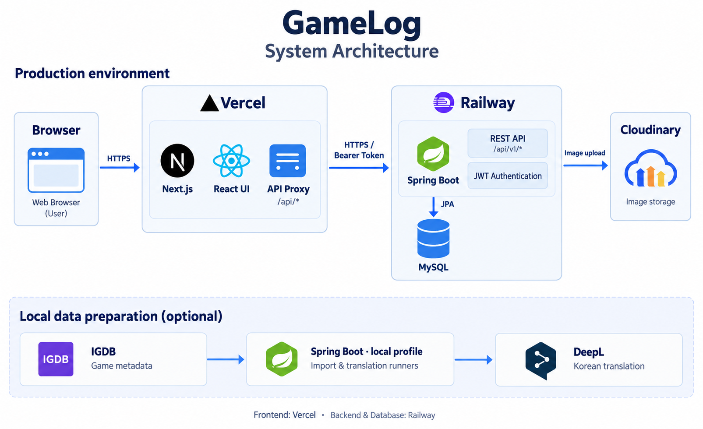

# GameLog 🎮

<div align="center">
  
  <br><br>
  <h3>플레이를 기록하고, 다음에 빠져들 게임을 발견하세요</h3>
  <p>게임 탐색부터 플레이 기록, 리뷰, 취향 기반 추천까지 연결하는 게임 기록 플랫폼</p>
</div>

---

## 📝 프로젝트 소개

**GameLog**는 즐긴 게임과 앞으로 플레이할 게임을 한곳에 모으고, 나의 기록을 바탕으로 새로운 게임을 발견하는 서비스입니다.

장르와 플랫폼으로 게임을 탐색하고, 플레이 상태·시간·평점·리뷰를 기록할 수 있습니다. 위시리스트와 백로그로 다음 플레이를 준비하고, 프로필에서 게임 기록과 취향 통계를 확인합니다.

처음 방문한 사용자는 온보딩에서 선호 장르와 게임을 선택해 추천을 받습니다. 플레이 기록이 쌓이면 실제 기록을 우선 활용해 개인화된 게임을 추천합니다.

> 프로그래머스 백엔드 데브코스 팀 프로젝트 · `NBE12-14-2-3355`

---

## ✨ 주요 기능 (Key Features)

### 1. 게임 탐색 · 검색

IGDB에서 수집한 게임 정보를 바탕으로 제목 검색, 검색어 추천, 장르·플랫폼 필터와 정렬을 제공합니다. 게임 상세 화면에서는 게임 소개와 장르·플랫폼, 평점·플레이 시간 통계, 연관 게임을 확인할 수 있습니다.

### 2. 나만의 게임 라이브러리

게임별 플레이 상태와 시간을 기록하고, 플레이 중 여부·위시리스트·백로그·좋아요를 관리합니다. 플레이 상태는 `PLAYED`, `COMPLETED`, `RETIRED`, `SHELVED`, `DROPPED`로 구분하며, 라이브러리에서 조건에 맞는 기록을 찾아볼 수 있습니다.

### 3. 리뷰 · 평점 · 좋아요

게임에 평점과 리뷰를 남기고 수정·삭제할 수 있습니다. 평점은 0.5 단위로 검증하며, 스포일러 여부를 표시할 수 있습니다. 다른 사용자의 리뷰에 좋아요를 남기거나 부적절한 리뷰를 신고할 수 있고, 관리자는 신고 목록과 처리 상태를 관리합니다.

### 4. 취향 기반 맞춤 추천

플레이 기록과 선호 장르, 연관 게임 정보, IGDB 평점을 조합해 최대 5개의 게임을 추천합니다. 추천에 사용할 플레이 기록이 없으면 온보딩에서 선택한 선호 게임·장르를 활용하며, 이미 기록한 게임은 후보에서 제외합니다.

### 5. 프로필 · 취향 통계

닉네임과 프로필 이미지를 수정하고, 좋아하는 대표 게임을 설정할 수 있습니다. 프로필에서는 라이브러리와 최근 기록, 장르 분포 등 자신의 게임 활동을 확인합니다.

### 6. 회원가입 · 로그인 · 온보딩

이메일 기반 회원가입·로그인과 이메일·닉네임 중복 확인을 지원합니다. 가입 후 선호 장르와 게임을 선택하거나 온보딩을 건너뛸 수 있습니다. 인증은 JWT Access Token과 Refresh Token을 사용합니다.

---

## 🔍 기술 하이라이트 (Tech Highlights)

### 기록 기반 추천과 온보딩 추천의 연결

`PersonalizedGameRecommendationService`는 추천에 사용할 수 있는 사용자 기록을 먼저 확인합니다. 기록 기반 추천에서는 연관 게임의 순위 점수와 상위 선호 장르의 가산점을 계산하고, IGDB 평점의 50%를 더해 최종 점수를 만듭니다.

추천에 사용할 기록이 없으면 온보딩 선호 게임을 우선 활용하고, 선호 게임도 없으면 선호 장르로 후보를 찾습니다. 후보 정보는 일괄 조회하며, 최종 점수·사용자 평균 평점·출시일·게임 ID 순으로 정렬해 최대 5개를 반환합니다.

### Next.js API 프록시와 JWT 인증

브라우저는 Next.js의 `/api/*` 경로로 요청하고, Route Handler가 Spring Boot의 `/api/v1/*`로 전달합니다. 백엔드 주소는 서버 환경변수 `BACKEND_URL`로 설정합니다.

Access Token은 `Authorization: Bearer` 헤더로 전달하고, Refresh Token은 HttpOnly 쿠키로 관리합니다. 프록시는 백엔드의 `Set-Cookie`와 `New-Access-Token` 응답 헤더를 전달해 인증 흐름을 연결합니다.

### IGDB 데이터 수집과 한국어 설명 번역

IGDB에서 받은 게임·장르·플랫폼·시리즈 정보를 관계형 데이터로 저장합니다. 기존 게임은 IGDB ID로 찾아 갱신하고, 연결 데이터는 존재 여부를 확인해 중복 저장을 방지합니다. 외부 API 응답을 받은 뒤 저장 트랜잭션을 시작합니다.

한국어 설명 번역에는 DeepL을 사용합니다. 원문과 SHA-256 해시를 보관해 같은 원문의 중복 번역을 건너뛰며, 외부 번역 요청 동안 DB 트랜잭션을 유지하지 않습니다. 실행당 번역 개수를 제한하고 API 잔여 한도를 확인합니다.

### Cloudinary 이미지 업로드

이미지는 백엔드에서 Cloudinary로 업로드하고 반환된 HTTPS URL을 사용합니다. 빈 파일과 `image/*`가 아닌 MIME 타입을 거부하며, 파일 및 요청 크기는 각각 최대 5MB로 설정되어 있습니다.

### 실행 환경 분리와 자동 빌드

프론트엔드는 **Vercel**, 백엔드와 MySQL은 **Railway**에 배포합니다. 로컬은 Docker MySQL, 테스트는 H2 인메모리 DB를 사용합니다. GitHub Actions는 push와 pull request 이벤트마다 Java 25 환경에서 백엔드 빌드와 테스트를 실행합니다.

---

## 🧰 기술 스택 (Tech Stack)

### Backend


### Frontend


Next.js App Router와 React Context를 사용하며, 화면 스타일은 CSS Modules와 전역 CSS로 구성합니다.

### Database · Tools · External APIs


- **H2**: 테스트용 인메모리 데이터베이스
- **IGDB**: 게임 메타데이터 수집
- **DeepL**: 게임 설명 한국어 번역
- **Gradle**: 백엔드 빌드 및 테스트
- **ESLint**: 프론트엔드 정적 검사

---

## 🏗 시스템 구성 (Architecture)



브라우저의 서비스 요청은 **Vercel의 Next.js API 프록시**를 거쳐 **Railway의 Spring Boot API**에 전달됩니다. 백엔드는 Railway MySQL에 데이터를 저장하고 Cloudinary로 이미지를 업로드합니다.

이미지 하단은 로컬 데이터 준비 과정입니다. IGDB 수집과 DeepL 번역은 `local` 프로파일에서 각각의 실행 옵션을 활성화했을 때 시작 시 수행합니다.

---

## 🛠 시작하기 (Getting Started)

### 1. 준비 사항

- JDK 25
- 프로젝트의 Next.js 버전을 지원하는 Node.js 및 npm
- Docker와 Docker Compose
- IGDB Client ID / Client Secret
- Cloudinary Cloud Name / API Key / API Secret
- 한국어 설명 번역을 실행하는 경우 DeepL API Key

이하 명령은 **저장소 루트에서 시작하는 Windows PowerShell 기준**입니다. macOS/Linux에서는 환경변수 설정에 `export`를 사용하고, `./gradlew.bat` 대신 `./gradlew`를 실행하세요.

### 2. MySQL 실행

```powershell
docker compose up -d mysql
docker compose ps
```

MySQL이 `healthy` 상태가 된 후 백엔드를 실행합니다. 로컬 기본 접속은 `localhost:3306`, 데이터베이스는 `gamelog`이며 계정 설정은 [docker-compose.yml](docker-compose.yml)에서 확인할 수 있습니다. 데이터는 `mysql-data` 볼륨에 보관됩니다.

### 3. 백엔드 환경변수 설정 및 실행

백엔드를 실행할 PowerShell에서 다음 값을 설정합니다. 아래 값은 실제 발급받은 정보로 교체하세요.

```powershell
$env:IGDB_CLIENT_ID = "your-igdb-client-id"
$env:IGDB_CLIENT_SECRET = "your-igdb-client-secret"
$env:CLOUDINARY_CLOUD_NAME = "your-cloud-name"
$env:CLOUDINARY_API_KEY = "your-cloudinary-api-key"
$env:CLOUDINARY_API_SECRET = "your-cloudinary-api-secret"

cd back
./gradlew.bat bootRun
```

기본 프로파일은 `local`입니다. 로컬 DB 계정을 변경했다면 `DB_USERNAME`, `DB_PASSWORD`도 설정하세요. 백엔드는 기본적으로 `.env` 파일을 자동으로 읽지 않으므로 셸 또는 IDE의 실행 환경변수로 주입합니다.

**처음 게임 데이터를 수집할 때**는 일반 실행 대신 다음 명령을 사용합니다.

```powershell
# back 디렉터리에서 실행
./gradlew.bat bootRun --args="--igdb.import.enabled=true"
```

기본 실행에서는 IGDB 자동 수집이 비활성화되어 있으므로, 비어 있는 DB에는 게임 목록이 표시되지 않습니다. 수집이 끝난 뒤에는 일반 실행 명령을 사용하면 됩니다.

<details>
<summary>선택: 게임 설명 한국어 번역</summary>

게임 데이터가 저장된 상태에서 DeepL 키와 실행 옵션을 설정합니다.

```powershell
$env:DEEPL_API_KEY = "your-deepl-api-key"
./gradlew.bat bootRun --args="--game.translation.enabled=true --game.translation.max-games=10"
```

번역은 기본적으로 비활성화되어 있으며, 위 명령은 한 번 실행할 때 최대 10개의 설명을 번역합니다.

</details>

### 4. 프론트엔드 실행

새 터미널을 열고 저장소 루트에서 실행합니다.

```powershell
cd front
Copy-Item .env.example .env.local
npm ci
npm run dev
```

`.env.local`의 `BACKEND_URL` 기본값은 `http://localhost:8080`입니다. 값을 바꾸면 프론트엔드 서버를 재시작하세요.

- **서비스**: [http://localhost:3000](http://localhost:3000)
- **Swagger UI**: [http://localhost:8080/swagger-ui/index.html](http://localhost:8080/swagger-ui/index.html)

### 5. 테스트 및 빌드

백엔드는 `back` 디렉터리에서 실행합니다. `test` 프로파일은 H2와 테스트용 외부 서비스 설정을 사용합니다.

```powershell
$env:SPRING_PROFILES_ACTIVE = "test"
./gradlew.bat build
Remove-Item Env:SPRING_PROFILES_ACTIVE
```

테스트 결과는 `back/build/reports/tests/test/index.html`에서 확인할 수 있습니다. 테스트 후 환경변수를 해제해야 같은 터미널에서 다시 실행할 때 기본 `local` 프로파일을 사용할 수 있습니다.

프론트엔드는 `front` 디렉터리에서 실행합니다.

```powershell
npm run lint
npm run build
```

---

## ⚙️ CI · 운영 설정

### 배포 환경

- **Vercel — Frontend**: `front`의 Next.js 애플리케이션을 배포합니다. 서버 환경변수 `BACKEND_URL`에 Railway 백엔드의 HTTPS 주소를 설정해 API 요청을 전달합니다.
- **Railway — Backend**: `back`의 Spring Boot 애플리케이션을 배포하며, `SPRING_PROFILES_ACTIVE=prod`로 운영 설정을 사용합니다.
- **Railway — Database**: MySQL을 운영하며, 백엔드는 아래 운영 프로파일의 DB 환경변수로 연결합니다.

### GitHub Actions

[Backend CI](.github/workflows/ci.yml)는 push와 pull request 이벤트에 실행됩니다.

1. 저장소 체크아웃
2. Temurin JDK 25 설치
3. `SPRING_PROFILES_ACTIVE=test` 설정
4. `back` 디렉터리에서 `bash ./gradlew build --no-daemon` 실행

현재 저장소의 워크플로우는 백엔드 빌드·테스트를 담당합니다. 자동 배포, 프론트엔드 검사, 커버리지 게이트는 이 워크플로우에 포함되어 있지 않습니다.

### 운영 프로파일

`prod`는 Railway MySQL 환경변수(`MYSQLHOST`, `MYSQLPORT`, `MYSQLDATABASE`, `MYSQLUSER`, `MYSQLPASSWORD`)를 사용합니다. `JWT_SECRET`, `CORS_ALLOWED_ORIGINS`와 외부 API 환경변수도 설정해야 합니다.

운영 DB는 `ddl-auto: validate`와 SQL 초기화 비활성화 설정을 사용하므로 실행 전에 스키마를 준비해야 합니다. 운영 Refresh Token 쿠키에는 `Secure`와 `SameSite=None`이 적용됩니다.

---

## 📂 프로젝트 구조 (Project Structure)

```text
NBE12-14-2-3355/
├── .github/workflows/          # 백엔드 CI
├── docs/                      # 시스템 구성도 이미지
├── back/
│   ├── src/main/java/com/gamelog/nbe121423355/
│   │   ├── domain/
│   │   │   ├── game/          # 게임 탐색, 수집, 번역, 추천
│   │   │   ├── user/          # 인증, 프로필, 온보딩 취향
│   │   │   ├── usergame/      # 라이브러리, 플레이 기록, 통계
│   │   │   └── review/        # 리뷰, 평점, 좋아요, 신고
│   │   └── global/            # 보안, 공통 응답, 예외 처리, 업로드
│   ├── src/main/resources/    # 프로파일별 애플리케이션 설정
│   ├── src/test/              # 서비스·컨트롤러·저장소 등 테스트
│   └── build.gradle.kts
├── front/
│   ├── public/                # 로고 및 정적 파일
│   ├── src/
│   │   ├── app/               # App Router 페이지와 API 프록시
│   │   ├── components/        # 게임 탐색·상세·기록·리뷰 UI
│   │   ├── features/          # 인증·프로필·리뷰·추천 API 및 상태
│   │   └── lib/               # API 유틸리티 및 프록시 공통 처리
│   └── package.json
└── docker-compose.yml         # 로컬 MySQL
```

<!-- 공개 전 추가할 자료: 실제 서비스 URL, 주요 화면 캡처, ERD, 팀원 및 담당 역할.
     측정 결과가 확보되면 성능 테스트 및 커버리지 섹션을 추가합니다. -->
